# Notion 博客同步流程图

本文档描述了从 Notion 数据库到博客网站的完整同步流程。

## 📊 完整流程图

```mermaid
flowchart TD
    Start([开始]) --> Notion[用户在 Notion 中创建/编辑文章]
    Notion --> SetStatus{设置 Status 为 Published?}
    SetStatus -->|否| Draft[保持 Draft 状态<br/>不会同步]
    SetStatus -->|是| Wait{等待同步触发}
    
    Wait -->|定时触发| Schedule[GitHub Actions<br/>每天 UTC 02:00<br/>北京时间 10:00]
    Wait -->|手动触发| Manual[手动触发<br/>GitHub Actions]
    
    Schedule --> Checkout[Checkout Repository]
    Manual --> Checkout
    
    Checkout --> Setup[设置 Python 环境<br/>安装依赖]
    Setup --> Config[配置 Git 用户信息]
    Config --> Sync[运行 sync_notion.py]
    
    Sync --> Query[查询 Notion API<br/>获取 Status=Published 的文章]
    Query --> HasPosts{有已发布文章?}
    
    HasPosts -->|否| NoChanges[没有更改<br/>结束流程]
    HasPosts -->|是| LoopStart[遍历每篇文章]
    
    LoopStart --> ExtractProps[提取文章属性<br/>Title, Date, Tags, Summary, Language]
    ExtractProps --> GetContent[获取文章内容<br/>通过 Notion Blocks API]
    GetContent --> Convert[转换 Notion Blocks<br/>为 Markdown 格式]
    
    Convert --> GenerateFrontmatter[生成 Frontmatter<br/>包含元数据]
    GenerateFrontmatter --> CreateFilename[创建 URL 友好的文件名]
    CreateFilename --> SaveMD[保存为 .md 文件<br/>到 blog/markdown/]
    
    SaveMD --> MorePosts{还有更多文章?}
    MorePosts -->|是| LoopStart
    MorePosts -->|否| Build[运行 build.py]
    
    Build --> ReadMD[读取所有 Markdown 文件]
    ReadMD --> ParseFrontmatter[解析 Frontmatter]
    ParseFrontmatter --> ConvertHTML[转换为 HTML]
    ConvertHTML --> SaveHTML[保存 HTML 文件<br/>到 blog/posts/]
    SaveHTML --> UpdateIndex[更新 blog/index.html<br/>生成文章列表]
    
    UpdateIndex --> CheckChanges{检测到更改?}
    CheckChanges -->|否| NoChanges
    CheckChanges -->|是| Commit[Git Commit<br/>提交更改]
    
    Commit --> Push[Git Push<br/>推送到 GitHub]
    Push --> Deploy[部署到 GitHub Pages]
    Deploy --> End([完成<br/>网站已更新])
    
    Draft --> End
    NoChanges --> End
    
    style Start fill:#e1f5ff
    style End fill:#c8e6c9
    style Notion fill:#fff3e0
    style Sync fill:#f3e5f5
    style Build fill:#f3e5f5
    style Deploy fill:#e8f5e9
    style NoChanges fill:#ffebee
```



## 🔄 详细步骤说明

### 1. 内容创建阶段
- **用户在 Notion 中创建文章**
  - 填写 Title（标题）
  - 设置 Date（发布日期）
  - 添加 Tags（标签，可选）
  - 填写 Summary（摘要，可选）
  - 选择 Language（语言：English 或 Chinese）
  - 编写文章内容（支持 Notion 所有格式）

### 2. 发布阶段
- **设置 Status 为 "Published"**
  - 只有 Status = "Published" 的文章才会被同步
  - Status = "Draft" 的文章不会出现在博客中

### 3. 同步触发
- **自动触发**：GitHub Actions 每天 UTC 02:00（北京时间 10:00）自动运行
- **手动触发**：在 GitHub Actions 页面点击 "Run workflow"

### 4. 同步执行阶段

#### 4.1 环境准备
```yaml
- Checkout repository
- Set up Python 3.9
- Install dependencies (requests, pyyaml, markdown)
- Configure Git user
```

#### 4.2 Notion API 查询
```python
# 查询所有 Status = "Published" 的文章
query_published_posts()
  ↓
提取文章属性：
  - Title
  - Date
  - Tags
  - Summary
  - Language
  ↓
获取文章内容：
  - 通过 Notion Blocks API
  - 转换为 Markdown 格式
```

#### 4.3 文件生成
```python
# 为每篇文章生成：
1. Markdown 文件 (blog/markdown/*.md)
   - 包含 Frontmatter（元数据）
   - 包含文章内容（Markdown 格式）

2. HTML 文件 (blog/posts/*.html)
   - 从 Markdown 转换
   - 使用文章模板
   - 包含完整的 HTML 结构

3. 更新 blog/index.html
   - 生成文章列表
   - 添加 data-language 属性
   - 按日期排序
```

### 5. 部署阶段
- **检测更改**：检查是否有文件被修改
- **提交更改**：如果有更改，执行 git commit
- **推送代码**：推送到 GitHub 仓库
- **部署网站**：自动部署到 GitHub Pages

## 📋 数据流转

```
Notion Database
    ↓ (Notion API)
文章属性 + 内容
    ↓ (notion_sync.py)
Markdown 文件 (.md)
    ↓ (build.py)
HTML 文件 (.html)
    ↓ (update_blog_index)
博客首页 (index.html)
    ↓ (Git Push)
GitHub Repository
    ↓ (GitHub Pages)
在线网站
```

## 🔑 关键组件

### 1. Notion API 集成
- **认证**：使用 Integration Token
- **查询**：过滤 Status = "Published"
- **内容提取**：通过 Blocks API 获取文章内容
- **格式转换**：Notion Blocks → Markdown

### 2. 文件处理
- **Markdown 生成**：`notion_sync.py`
  - 提取元数据
  - 转换内容格式
  - 生成 Frontmatter
  
- **HTML 生成**：`build.py` + `simple_md_converter.py`
  - 解析 Frontmatter
  - Markdown → HTML
  - 生成文章页面
  - 更新博客首页

### 3. 自动化部署
- **GitHub Actions**：`.github/workflows/notion-sync.yml`
  - 定时触发
  - 手动触发
  - 自动构建和部署

## ⚙️ 配置要求

### Notion 数据库字段
- **必需字段**：
  - `Title` (Title 类型)
  - `Status` (Select 类型: Draft/Published)
  - `Date` (Date 类型)
  
- **可选字段**：
  - `Tags` (Multi-select 类型)
  - `Summary` (Text 类型)
  - `Language` (Select 类型: English/Chinese)

### GitHub Secrets
- `NOTION_TOKEN`：Notion Integration Token
- `NOTION_DATABASE_ID`：Notion 数据库 ID

## 🎯 工作流程总结

1. **写作**：在 Notion 中创建和编辑文章
2. **发布**：设置 Status = "Published"
3. **同步**：GitHub Actions 自动或手动触发同步
4. **转换**：Notion → Markdown → HTML
5. **部署**：自动部署到 GitHub Pages
6. **访问**：用户访问更新后的博客网站

## 📝 注意事项

- 只有 Status = "Published" 的文章会被同步
- 同步是增量式的，只处理有更改的文章
- 如果没有更改，不会触发部署
- 支持多语言（English/Chinese）文章
- 自动生成文章摘要（如果未提供）
- 自动创建 URL 友好的文件名

